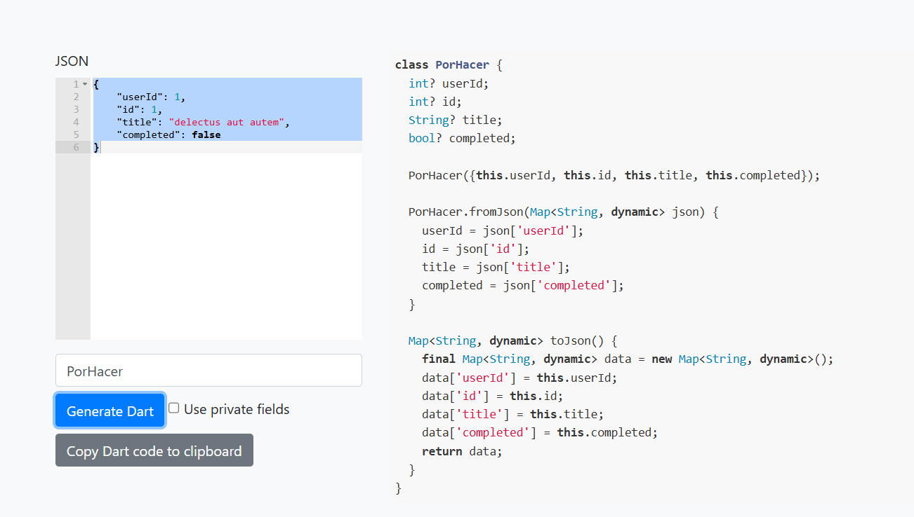
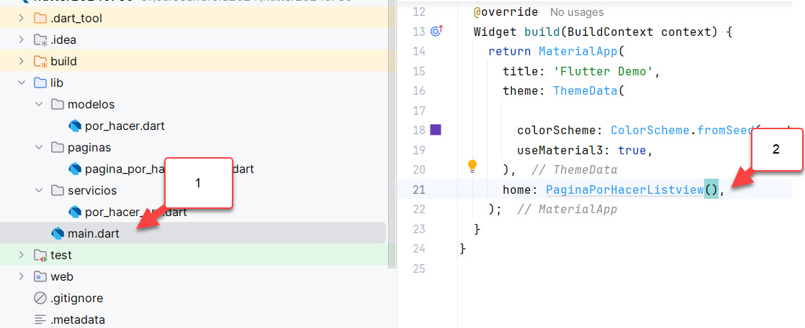
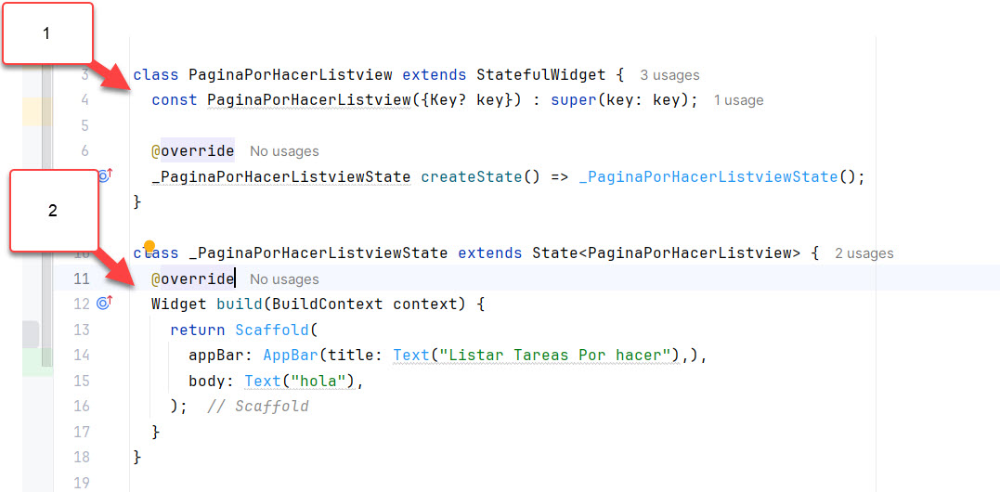

# flutter20240730

## modificar el main.dart

```dart
import 'package:flutter/material.dart';

void main() {
  runApp(const MyApp());
}

class MyApp extends StatelessWidget {
  const MyApp({super.key});

  // This widget is the root of your application.
  @override
  Widget build(BuildContext context) {
    return MaterialApp(
      title: 'Flutter Demo',
      theme: ThemeData(

        colorScheme: ColorScheme.fromSeed(seedColor: Colors.deepPurple),
        useMaterial3: true,
      ),
      home: Text("hola"),
    );
  }
}
```

## planificar el proyecto

> Este proyecto se planifica usando OOP Programacion orientada a objeto.


### web service de ejemplo:

* https://jsonplaceholder.typicode.com/todos/1  (obtener un elemento)
* https://jsonplaceholder.typicode.com/todos/  (listar todo)

### modelo

https://javiercbk.github.io/json_to_dart/

* Copie el json del ejercicio de Web Service.
* Luego, indique el nombre de la clase
* Y finalmente genere el codigo




### servicio

Luego, cree una clase de servicio con todas las funcionalides que va a ocupar.

En este caso solo quiero listar objetos PorHacer.  Todavia no hace la operacion, pero no genera error.

```dart
import 'package:flutter20240730/modelos/por_hacer.dart';

class PorHacerSrv {
  static List<PorHacer> listarTodo() {
    return [
      PorHacer(id: 1,userId: 1,title:"titulo1",completed: true), // argumentos con nombre.
      PorHacer.nuevo(2, 2, "titulo2", true) // argumentos posicionales
    ];
  }
}
```


### paginas (widgets)

> Comunmente las paginas que tienen un widget de scaffold. Pueden ser con o sin estado.

Cree un widget con estado que tenga un Scaffold y que tenga lo minimo (appbar y body)

```dart
import 'package:flutter/material.dart';

class PaginaPorHacerListview extends StatefulWidget {
  const PaginaPorHacerListview({Key? key}) : super(key: key);

  @override
  _PaginaPorHacerListviewState createState() => _PaginaPorHacerListviewState();
}

class _PaginaPorHacerListviewState extends State<PaginaPorHacerListview> {
  @override
  Widget build(BuildContext context) {
    return Scaffold(
      appBar: AppBar(title: Text("Listar Tareas Por hacer"),),
      body: Text("hola"),
    );
  }
}
```

> Luego, vaya a main.dart y use la pagina.



Luego, en la pagina, necesitamos tener campos (valores) de los datos que queremos ocupar y mostrar.

Si el widgets es con estado (en este caso lo es), tenemos dos opciones.

* En la primera clase (Widget)
* En la clase de Estado

Si yo necesito que es campo se comparta con otro widget diferente, entonces tiene que ir en la clase de widget (y además tiene que estar en el constructor). En caso contrario se puede agregar en la clase de estado.



En este caso se va a agregar el campo en la clase de estado

```dart
class _PaginaPorHacerListviewState extends State<PaginaPorHacerListview> {
  List<PorHacer> porHacerListado=PorHacerSrv.listarTodo();
  
  @override
  Widget build(BuildContext context) {
    return Scaffold(
      appBar: AppBar(title: Text("Listar Tareas Por hacer"),),
      body: Text("hola"),
    );
  }
```

### widgets

Vamos a generar un widget para mostrar el listado de tareas por hacer. Como tengo valores que vienen de la pagina, hay que agregar el campo de listado a la clase de widget y al constructor

```dart
import 'package:flutter/material.dart';

import '../../modelos/por_hacer.dart';

class ListviewPorHacer extends StatefulWidget {
  List<PorHacer> porHacerListado;
  ListviewPorHacer(this.porHacerListado, {Key? key}) : super(key: key);

  @override
  _ListviewPorHacerState createState() => _ListviewPorHacerState();
}

class _ListviewPorHacerState extends State<ListviewPorHacer> {
  @override
  Widget build(BuildContext context) {
    return Container();
  }
}

```

> Luego, vaya a la pagina, y use ese widget en el body.

```dart
class _PaginaPorHacerListviewState extends State<PaginaPorHacerListview> {
  List<PorHacer> porHacerListado=PorHacerSrv.listarTodo();

  @override
  Widget build(BuildContext context) {
    return Scaffold(
      appBar: AppBar(title: Text("Listar Tareas Por hacer"),),
      body:ListviewPorHacer(porHacerListado),
    );
  }
}

```

Y finalmente, modifique el widget de listado para que muestre los valores en un listview

```dart
class _ListviewPorHacerState extends State<ListviewPorHacer> {
  @override
  Widget build(BuildContext context) {
    return ListView.builder(
      itemBuilder: (BuildContext context, int fila) {
      return Text(" ${widget.porHacerListado[fila].title} ${widget.porHacerListado[fila].id} ");
      },
      itemCount: widget.porHacerListado.length,
    );
  }
}
```


